+++
title = "Legojam: Creatown"
date = "2024-06-17"
+++
What walks on four legs in the morning, two legs at noon, and three legs in the evening? A LEGO Create 3-in-1 set!
<!-- more -->
Gangs of skateboarders drawn to the dramatic terrain of crags, canals and forests that crowd unbuilt areas.
The electric age harnesses the chaos of the landscape and inhabitants, but nature looms close between the borough's buildings.
Powerful groups vye for influence as Creatown's structural and political stability hang in the balance.
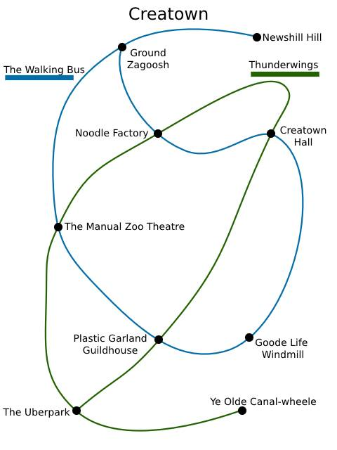
## Routes
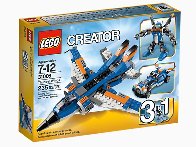
**Thunderwings** *Thunder Wings 31008*
A powerful transporter on the nasty hills, reassembled into a large glider while the driver's are being changed.
Uphill, carried by a platoon of small robots, who will accept bribes to skip a stop or two.
Constantly breaking down, but unmatched for speed and fares when working.
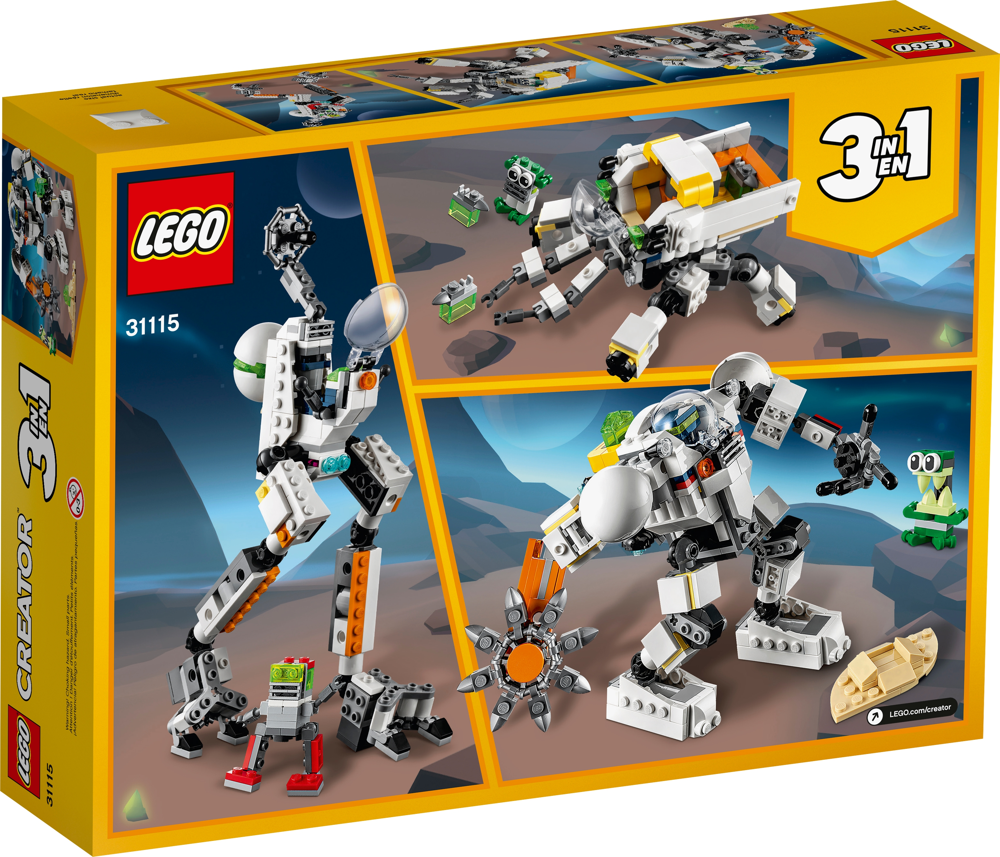
**The Walking Bus** *Space Mining Mech 31115*
Takes a novel approach to the rocky terrain, tearing through it to make room for a cart of passengers.
Not legally liable for any resulting landslide damage.
Strange monsters are uncovered in the rocks, often very angry to be disturbed.

## Landmarks / Factions
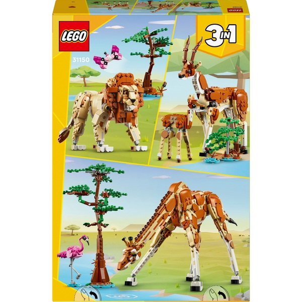
**The Manual Zoo Theatre** *Wild Safari Animals 31150*
A draw for locals and tourists alike, the improv troupe who run this venue puppet preserved pelts into eerie animal performances.
Though nature flourishes nearby, surrounding area stinks of fetid meat.
Rumours of disappearences on opening nights, which management vehemently deny.

**Plastic Garland Guild** *Flowers in Watering Can 31149*
The raincoat-makers and flower-growers realised a shared common interest, a better use for all that canal water.
Members are easily distinguished by their yellow macs and pockets full of soil. They sell strange plants and automatic hoods.
Anyone making requests or enquiries eventually finds themselves directed to *Sprinkle* and *Crackers*, two very senior mock parrots who disagree about everything.
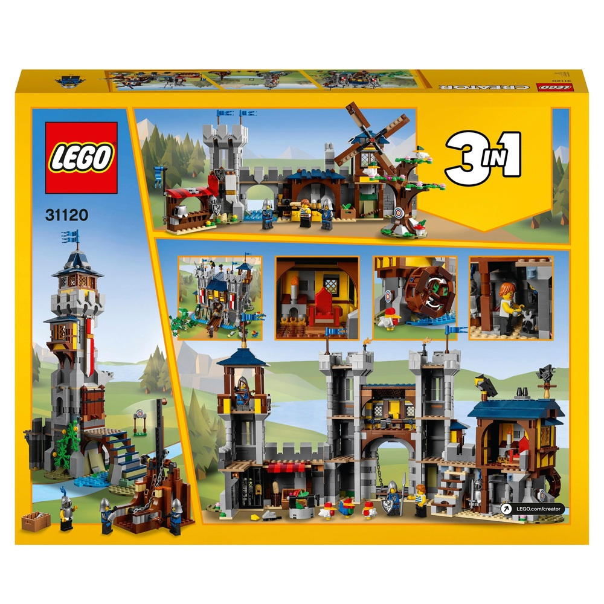
**Goode Lifee Energy Association** *Medieval Castle 31120*
A wealthy company founded by barons who annoyingly claim the borough is a historic village.
Fortune comes from powering the electric age through their many canal wheels and windmill headquarters.
Higher ranked officials wear metal helmets said to enable conversation with woodland animals.
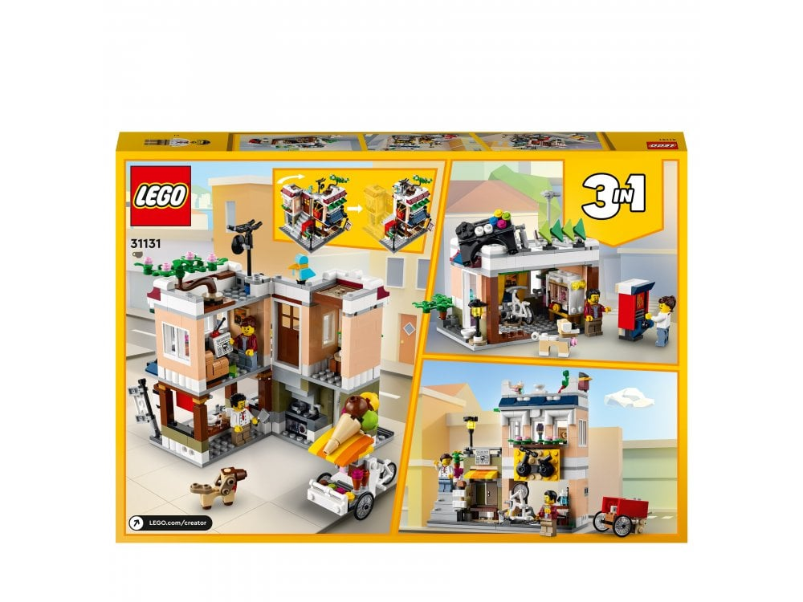
**The Noodle Factory** *Downtown Noodle Shop 31131*
The other major electrical supplier in Parkhorne, thanks to their huge hall of dynamo una-, bi- and tri-cycles.
As well as electricity, make excellent noodles. The conducting sort are hung across the borough, powering numerous shops when left un-nibbled.
The very strong union includes, for historical reasons, ice cream sellers, whose bikes now also dominate the streets here.

## Cast
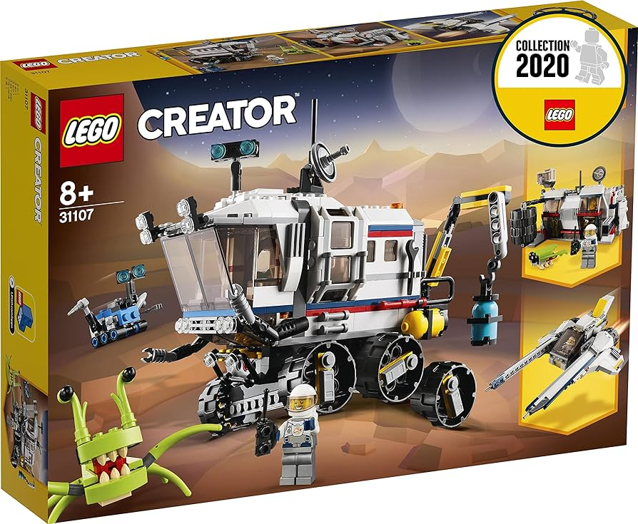
**Zagoosh**, Alien *Lunar Rover 31107*
Charismatic and mysterious, crash landed from the Living Stars several months ago.
Impossible to make sense of, easy to understand. Made high judge of local court.
Eagerly courted by many powerful organisations, busy hatching flies and rebuilding ship.
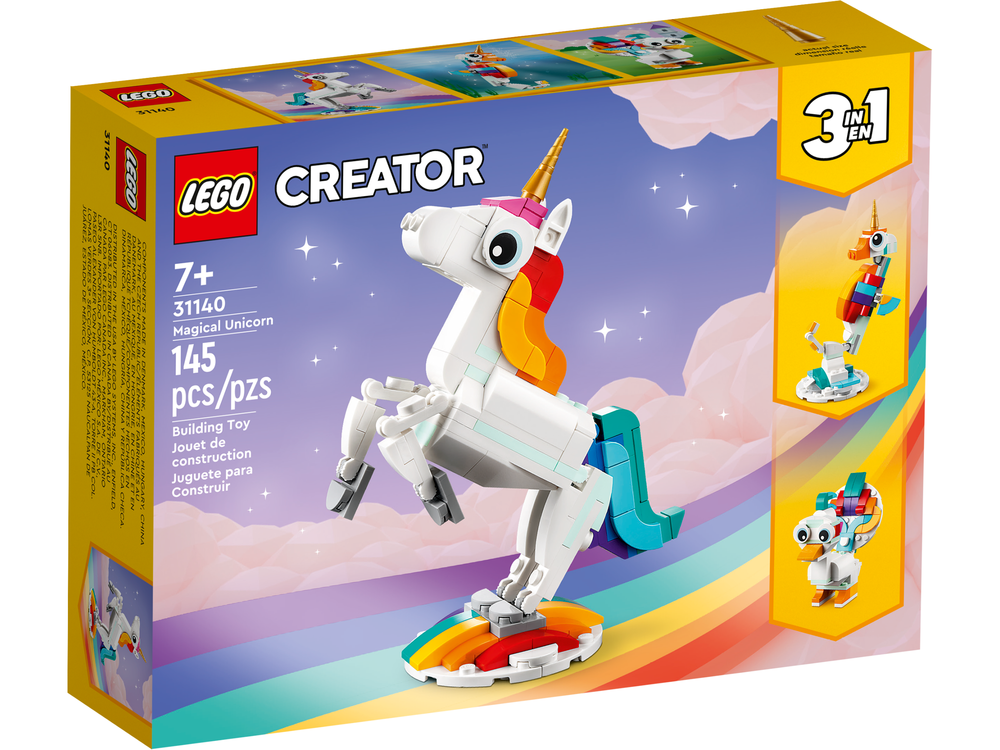
**Jalahar**, Mock Unicorn *Magical Unicorn 31140*
Influentual ice cream seller, feared and respected, travels by megaduck or seahorse around Parkhorne's complex terrain.
Talks in imperatives, often hunting new and complex flavours.
Gunning for a top spot in the Noodle Factory Union.
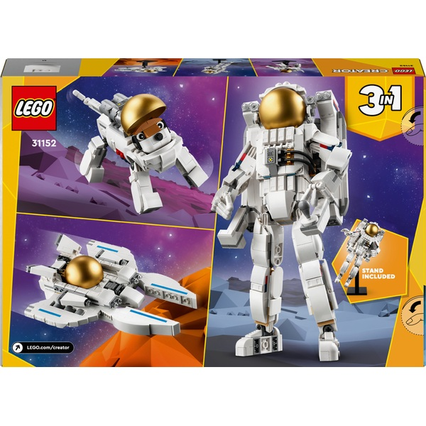
**Astroboss and Astrodog**, Skaters *Space Astronaut 31152*
Once best friends, their famed double-skateboard and shared gang both split in half when the two fell out.
The ensuing turf war has left them with largely mechanised bodies requiring constant power suppply to stay moving.
Will stop at nothing to see the other on the stand.

## Events
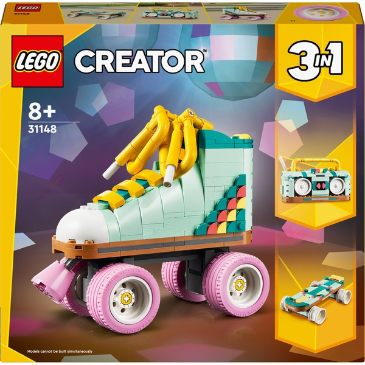
**Roller Radio** *Retro Roller Skate 31148*
A fading media empire try a new tactic, radio carrying rollerbladers, who trail the walking bus blaring top stories.
Some skateboarding gangs who've long used the bus's wake as a park see this as an incursion, others want to take the contract.
There's only one way to settle it all- skate contest. But what judge would brave the threat of landslides to close this conflict?

**The Flying Scout Hut** *Outback Cabin 31098*
A flotilla of teenage scout clubhouses storm the borough's waterways, eager to earn their fishing badges.
Three councils declare scouting unlawful. Two are fished clean off the street within a week.
Recently out of work bag-fillers and local youths team up to take down the scouts. Fortresses are erected and different factions take sides.
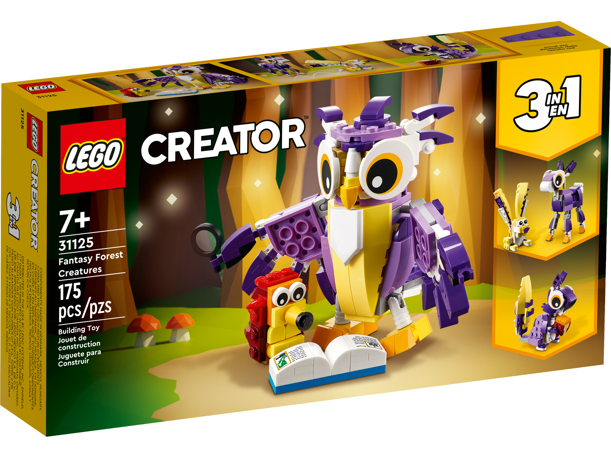
**Campaign for Animal Literacy** *Fantasy Forest Creatures 31125*
A diminutive mock hedgehog is seen walking among the parks, a comically large book under one anoraked arm and an entourage of rapt animals following.
Increasingly purple creatures are spotted amongst the trees, with eerily large eyes. What are they looking for? Why are they watching?
Animals flood the streets, hungry for imported fiction and noodles, ready to sieze both. 

My entry for the Summer LEGO setting jam, a borough for electric bastionland inspired by the 3-in-1 LEGO create sets that were around when I was a kid. I was struggling a bit for ideas, since these lack the nostalgia factor of more charming older LEGO sets, but realised the 3 option sets acted like their own spark tables. In Bastionland fashion I've tried to stay concise throughout here, and have mostly followed the structure of example boroughs in the book. The result is pretty tied to that game, but hopefully there's space for Creatown in any weird and wacky city with a vaguely modern setting.

Also, while searching around for this I discovered [rebrickable](https://rebrickable.com/mocs/?theme=672), a website where people have made their own creations out of existing sets, which fits perfectly with the 3-in-1 idea and could be another cool source of inspiration for anyone else creating something for the jam.
